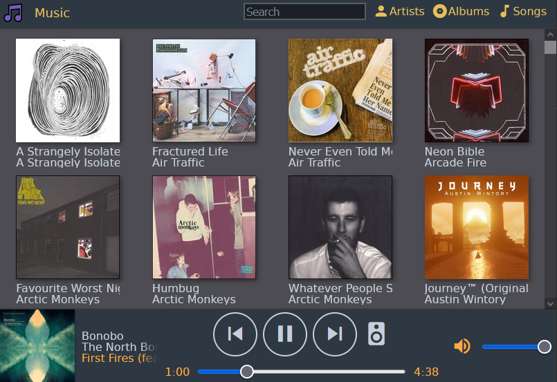
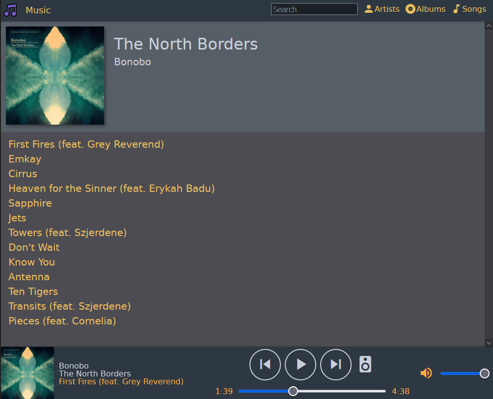
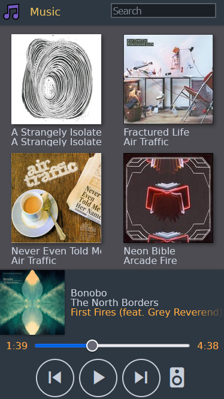

Music Box
=========

A music player app that streams music from your raspberry pi within your local network. 
It can also discover, control and stream music to Sonos devices found in the local network.




It can be added to your home screen on iOS which makes it behave like a native app.



Caveats/Warnings
----------------

Don't expose this to the internet. This software also writes `Folder.jpg` files if they are missing to the disk. 

No responsibility is accepted for corrupted media folders as a result of using this software. This software is used at your own risk, the same as any open source software.

Building for Raspberry PI
=========================

Git clone this repo and install [go.1.19](https://go.dev/dl/) and then you can cross compile for pi (this is from windows box):

```
set GOOS=linux
set GOARM=5
set GOARCH=arm
go build -tags static
scp music pi@rasperrypi
```

Running on a Raspberry PI
=========================

Check it works properly by pointing it at a directory containing `mp3` or `m4a` files. Pressing Ctrl-C will shutdown the server. I'm assuming you've already [Mounted your USB Drive](#mounting-music-usb) at `/media/data`
```
ssh pi@raspberrypi
pi@raspberrypi:~ $ chmod +x music
pi@raspberrypi:~ $ ./music -folder=/media/data
2023/01/16 21:23:12 music server 🎵 serving music from /media/data at http://192.168.1.228:3000
2023/01/16 21:23:12 listening on :3000
```

Scanning for Music
------------------

On startup it will scan for music in the music folder. We generally assume music is in a `<Artist>/<Album>/<Track>.<mp3/m4a>` folder structure, but it can cope with stuff outside of this.

We look at the tags applied to each music file found to determine the Artist and Album. If this isn't found we fallback on assuming the folder names indicate the Artist then Album. 

We then look for `<Artist>/<Album>/Folder.jpg` for Album Art which if you've copied over Music from Windows will generally exist. If `Folder.jpg` doesn't exist we first attempt to extract it from the music file metadata, then failing that we attempt to lookup the art on https://musicbrainz.org/ and download the first album that we find.

To avoid spamming musicbrainz re-requesting art for Albums that we don't find we spit out a `albums.csv` file to avoid querying music brainz again on restart.

Sonos Integration
-----------------

Music Box will automatically try to discover sonos devices on startup. If it finds anything you'll see a log line on startup like this:

```
2023/01/16 21:23:12 found sonos: Office
```

Mounting a USB Drive
--------------------

This will mount a USB stick containing music files on boot at `/media/data` on your PI.

First figure out your USB key UUID - it's probably `/dev/sda1`

    sudo lsblk
    /dev/sda1: LABEL="ESD-USB" UUID="6CA4-D428" BLOCK_SIZE="512" TYPE="vfat" PARTUUID="d3476d88-01"

then grab the UUID and stick it into `/etc/fstab` then mount the drive.

	sudo mkdir /media/data
	echo 'UUID=6CA4-D428 /media/data vfat uid=1000,umask=002,gid=users,defaults,auto,users,rw,nofail,noatime 0 0' | sudo tee -a /etc/fstab
	sudo mount -a

Installing as a System Service on PI
====================================

```
sudo mkdir /opt/musicbox
sudo cp music /opt/musicbox/music
sudo nano /lib/systemd/system/music.service`
```

then plonk this into `music.service`

```
[Unit]
Description=Music Box
After=network-online.target media-data.mount
Requires=media-data.mount

[Service]
ExecStart=/opt/musicbox/music -folder=/media/data/Music
WorkingDirectory=/opt/musicbox
StandardOutput=inherit
StandardError=inherit
Restart=always
User=pi

[Install]
WantedBy=multi-user.target
```

Next start the service, check it is working properly (exiting with q):

```
sudo systemctl start music
sudo systemctl status music
```

If you need to edit `music.service` follow these steps

```
sudo systemctl daemon-reload
sudo systemctl start music
```

Finally enable the service on boot.

```
sudo systemctl enable music
```

You can now check the status and restart, stop like this:

```
sudo service music status
sudo service music restart
```
